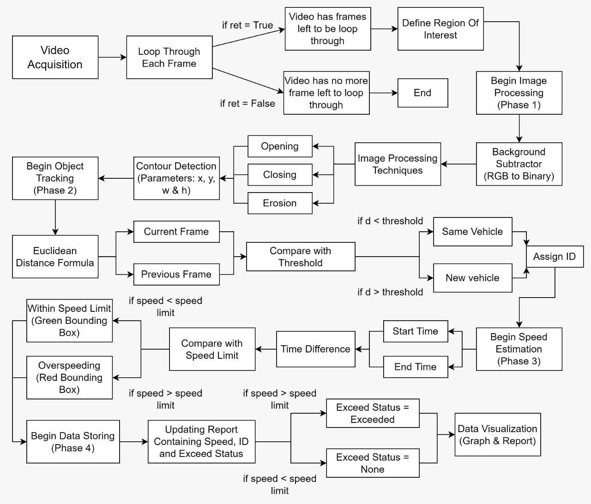
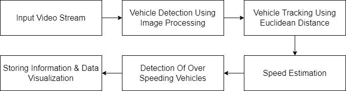
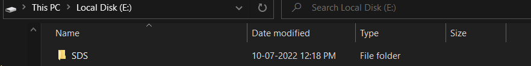
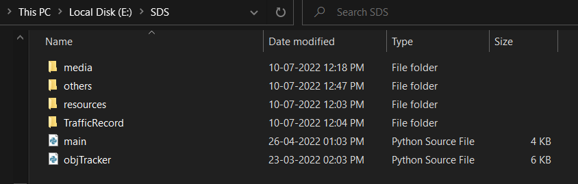

# Speed Detection System

  

## Why do we need a speed detection system?

Speed control on highways and accident prone areas has been a challenging conundrum for government on a global scale. According to reports there are approximately 4 lakh crashes each year causing upto 1 lakh deaths all over the world. A majority of them are caused by overspeeding vehicles which can be controlled by implementing a proper monitoring system that is able to detect overspeeding vehilces.

## Overview

The idea was to develop a vehicle speed detection system using video streaming. This
system requires a video stream which consists of components like vehicles which are in state
of motion, starting point and ending point. The system is designed to detect and track the
vehicles to calculate the speed of each vehicle. This project is an implementation of Speed
Detection System (SDS) which can be used as an alternative for radar and other existing
systems. SDS uses several image processing techniques on video stream captured from
camera, which makes SDS capable of calculating the speed of moving objects avoiding the
traditional radar problems.

## Methodology

SDS process is divided into four phases; first phase is the object detection in which
the vehicles that are passing through the road would be detected successfully by using image
processing methods. After completion of object detection phase the next step consists of
object tracking in which the detected vehicle having assigned ID is tracked over frames by
using Euclidean distance formula. Finally from distance and traveled time of detected vehicle,
speed of that vehicle is determined by using speed function formula.
Lastly, images of each individual vehicle would be captured and stored in desired
location. At the end, data visualization and file methods would be used to store and represent
all the data that has been collected from object detection, object tracking and speed estimation
phase. 

## Flowchart

  

## Implementation 

There are four main stages of implementation:
- Vehicle detection using image prcessing techniques such as opening, closing and erosion to identify multiple vehicles in the frame.
- Vehicle tracking using euclidean distance formula to track multiple vehicles across the frame and assign them unique IDs.
- Speed estimation using speed formula to identify over-speeding vehicles.
- Data representation for info gathering and visualization.

## Block Diagram 

  

## Software 

- OS Windows 10
- Python Programming Language
- Python Libraries (openCv, matplotlib, numpy, dateandtime etc)

## Requirements 

Install latest version of python from here: <a href="https://www.python.org/downloads/" target="_blank">Download</a>

Install respective python modules by using following commands:

`pip install opencv-python`

`pip install matplotlib`

`pip install numpy`

## Deployment

To deploy this project create a `SDS` folder inside your `E drive`.

  

Create a `resources` folder inside `SDS` folder and place `traffic` file inside. Click here to download traffic.mp4 file: <a href="https://drive.google.com/drive/folders/1d22cp2Fw9vk3DxcUdtWovjdlWmGkNiQz?usp=sharing">Download</a>

Create a `TrafficRecord` folder inside `SDS` folder and create a `exceeded` folder inside it.

This is how your project directory must look.
 

  

